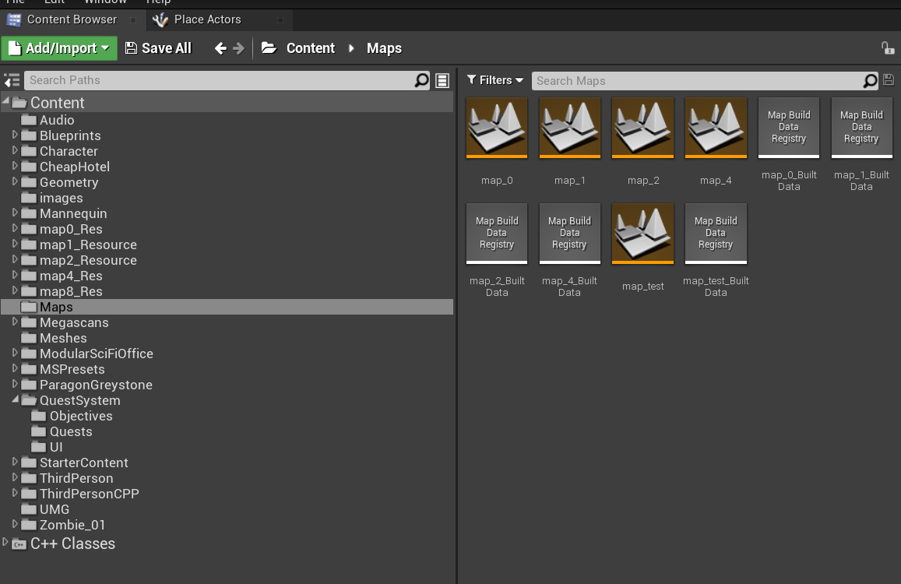
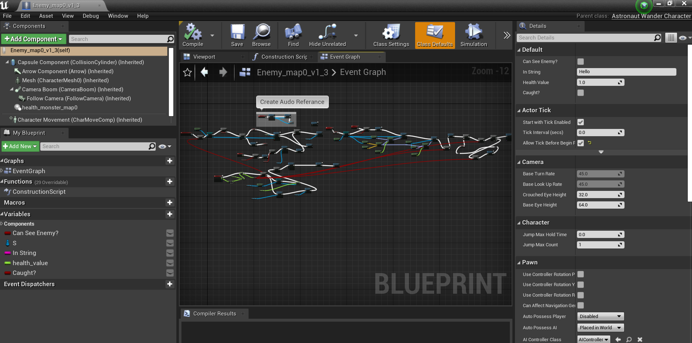
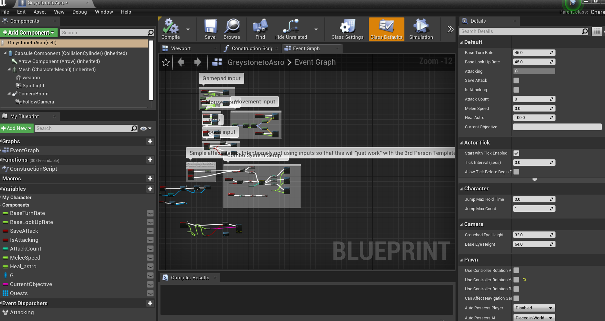
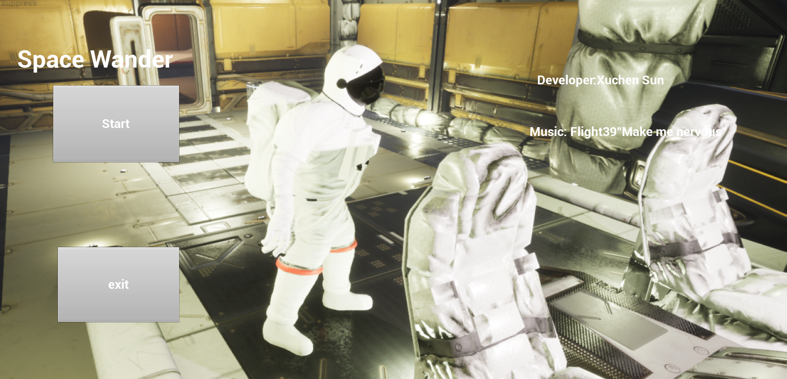
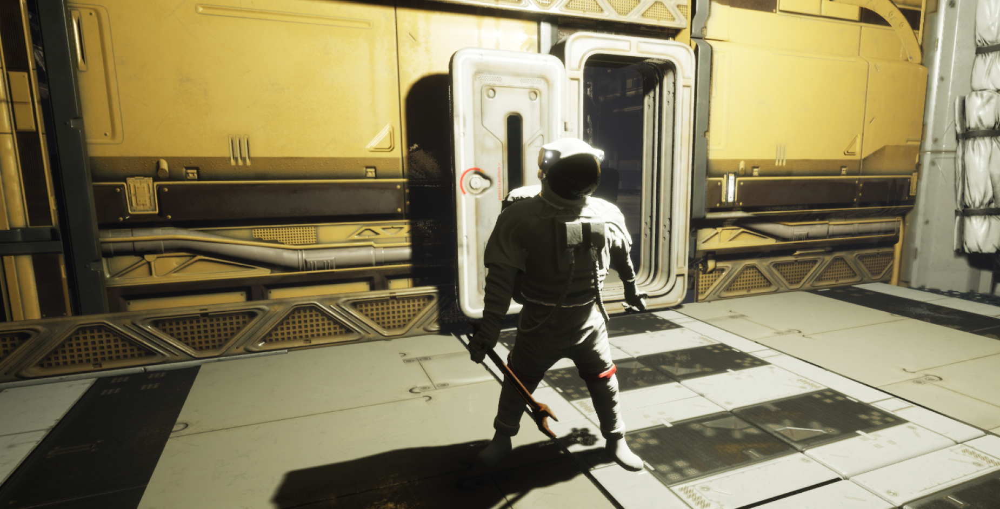
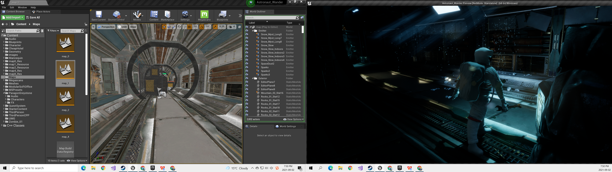

# Astronaut-Wander  37 Game Studio
Game Developing

# GroupMember Xuchen Sun & Sigan Sun

# Kanban Board(Agile Development Environment)
| Backlog | Progress | Test |
|      :---   |     :---:      |          ---: |
| 1Pre Map Design   | Finished(Xuchen)     | Pass(Xuchen)    |
| 2Enemy1     | Finished(Xuchen)       | Pass(Xuchen)      |
| 3Main Character Design     | Finished(Xuchen)       | Pass(Xuchen)      |
| 4Log In page     | Finished(Xuchen)       | Pass(Xuchen)     |
| 5Map0     | Finished(Xuchen)       | Pass(Xuchen)     |
| 6Map1     | Finished(Xuchen)       | Pass(Xuchen)      |
| 7Task System     | Finished(Xuchen)       | Testing(Sigan)      |
| 8Music Desgin     | Developing(Sigan)       |      |
| 9Task Objects Desgin(map0)     | Developing(Xuchen)       |      |
| 10Map2     |        |      |
| 11Map3     |        |      |
| 12Map4     |        |      |
| 13Animation     |        |      |

# 1Pre Map Design

# 2Enemy1 

# 3Main Character Design

# 4Log In page

# 5Map0

# 6Map1

# 7Task System

1Press TAB to enter task system and 

2Gray words mean unfinished and white words mean finished

3 Three kind of task system: sequence and parallel 
# 8Music Search

# 9Task Objects Desgin(map0)
1 Linear Task（Reach to Trigger）

2 Parallel Task（Electric Control）

# 10Map2

# 11Map3

# 12Map4

# 13Animation and video with camera
